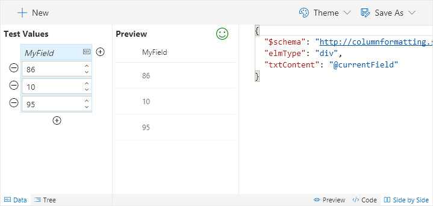
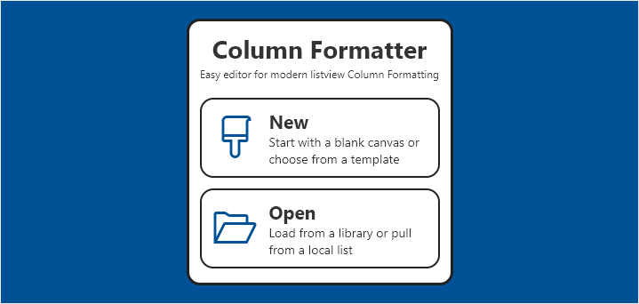
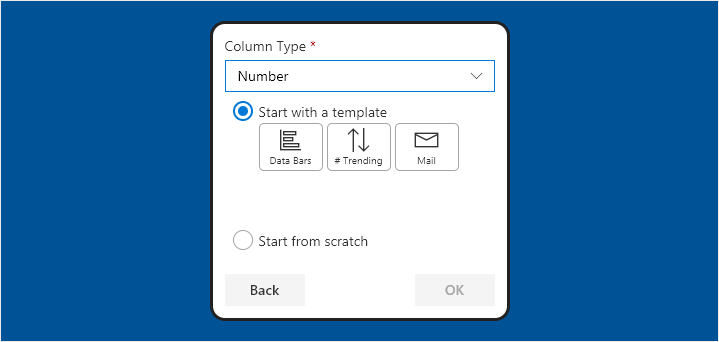
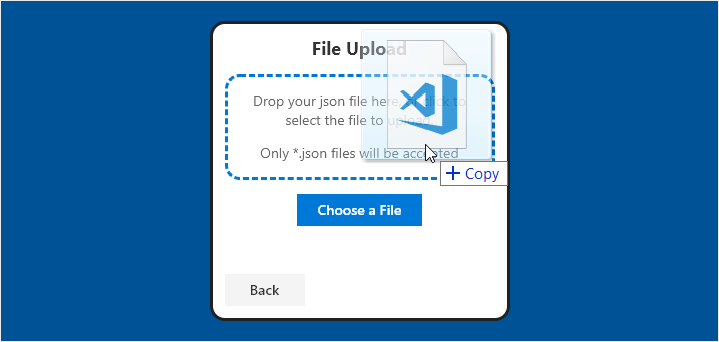
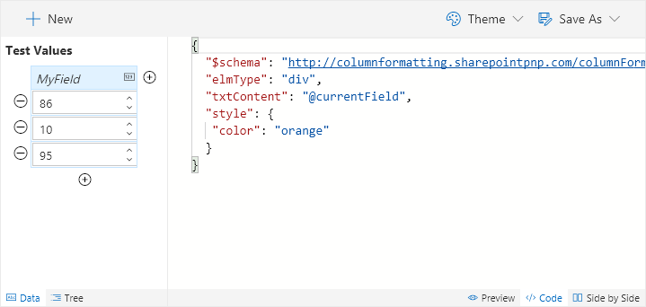
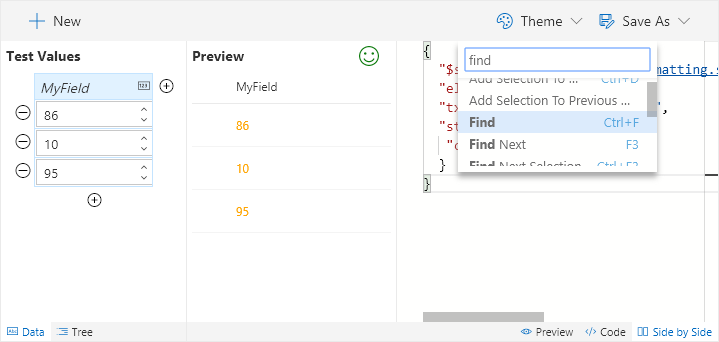
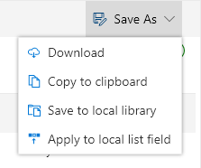
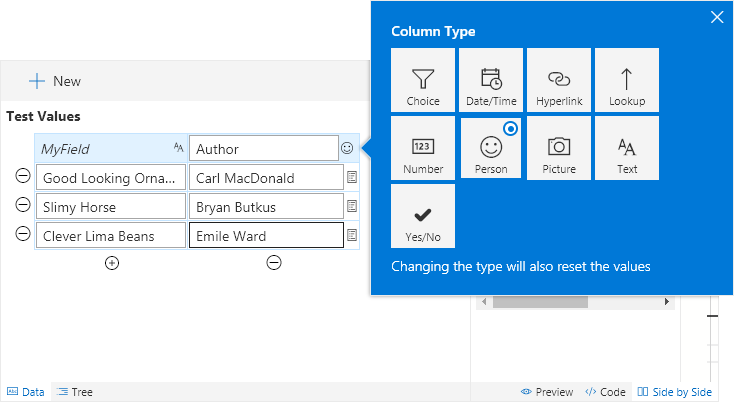
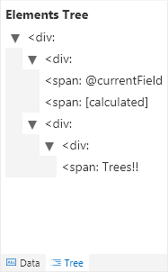
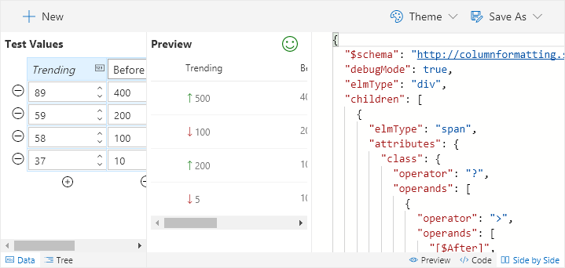

# Column Formatter

Easy editor for modern listview Column Formatting



## Introduction
Modern listviews support the addition of [custom formatting](https://docs.microsoft.com/en-us/sharepoint/dev/declarative-customization/column-formatting) for most field types. This is an awesome feature designed to make custom formatting simpler and less administratively difficult than packaged solutions.

Unfortunately, the tooling is still very minimal. Users are given a simple text field within a panel to paste the **JSON code** and a preview and save button. The panel is clearly not designed to enable editing meaning that not only do users have to write code, they have to find someplace to do it.

The official suggestion is to use VS Code which will provide some auto completion using the standard schema. However, there are several downsides to this approach:
 - Requires a desktop client to be installed
   - Non developers that may have hung on past the initial mention of JSON are mostly gone by now
 - Once you do get VS Code up and running and begin editing your JSON:
   - The intellisense and syntax checking are *very* limited (using the default schema)
   - There is no preview of your format (unless you copy and paste in the listview panel)
   - While some examples exist, there's still a huge learning curve

### Why Column Formatter
Column Formatter has been designed to give the full power of VS Code editing while providing easy to use templates and wizards all within the browser! The goal is to make writing and applying Column Formatting easier and quicker for both developers and end users.

Column Formatter has a ton of great features (see below), but where it really shines is the ability to **integrate it directly on your site** (it's a client-side webpart). This brings the tooling to where users are and enables cool features like loading and saving directly to the list fields you want to target.

Not only do users have access to many of the features they would have had to install VS Code for, the **schema validation (intellisense and syntax checking)** is based on a [verbose schema](https://thechriskent.com/2017/11/22/a-verbose-schema-for-sharepoint-column-formatting-proposal/) that provides far more assistance than the default.

Even more importantly, through the use of **wizards** it's possible that users won't have to touch or even see code at all to be able to take advantage of the powerful column formatting features of Office 365 modern listviews!

## Getting started



When you first open Column Formatter you are given the option to start a **New** project (either from scratch as a blank canvas or using one of the provided templates / wizards) or you can continue from an existing project by choosing **Open**.

### Starting a new project

Choose **New** on the welcome screen.

The first thing you'll need to do is select the type of column you are targeting in the **Column Type** dropdown. This will filter the available templates and customize the starting code and sample data as appropriate.



You can either start from a template (see the Templates section below) or start from scratch (blank canvas).

### Opening an existing project

Choose **Open** on the welcome screen.

You can load an existing Column Formatting json file from a document library or by uploading a file. You can also load the Column Formatting values from an existing local list field.

#### Loading from a local list

Choose **Load from a local list** and click **Next**.

Choose the list and then the corresponding field. Only visible lists are shown (Hidden = false) and only fields that can accept column formatting are shown. Click **OK** to load the formatting from your list field.

#### Uploading a file from your computer

Choose **Load from a file**, pick the **Column Type**, choose **Upload a file** and click **Next**.

You can either drag a \*.json file directly on to the window and release in the dashed rectange, or click the button to browse for the file.



## Using the Editor



The included editor is a custom build of the Monaco Editor which is a derivative of Visual Studio Code. There are a lot of really powerful features that make writing your Column Formats quick and easy.

### Intellisense and format correction
As you type, suggested keywords will display to help guide you in writing your code.


Syntax errors will be highlighted as they are detected. Hover over either the frowny face in the preview pane or the red squiggly in the editor to get a hint for what the problem may be.

You also have access to the command palette (press F1) that will provide you with many advanced features.



There are a lot of other great features, here are a few highlights:
 - Code Folding
 - Theme Selection
 - Auto Trim Whitespace
 - Find & Replace
 - Hot Keys
 - Verbose Syntax
   - Richer suggestions than in standard VS Code for Column Formatting
 - As you type validation
 - As you type **live** preview
 - Go to line
 - and more!

## Saving
You have several options available to save your work. Select the **Save-As** menu in the top-right to see your options.



### Download
Choose **Download** to have a json file generated and saved to your downloads folder. This makes it easy to check into code repositories or edit elsewhere.

### Copy to clipboard
Choose **Copy to clipboard** to have the json code available to paste. This can be used to paste directly in a listview dialog format pane. However, Apply to list is even easier.

### Save to a local library
Choose **Save to a local library** to save the json file to a document library on the site. Choose your library from the list of options, provide a folder path if desired, and change the filename as needed then press **Save**.


### Apply to local list field
Choose **Apply to local list field** to save your Column Format directly to a list field (have it applied in the modern listview). Choose your list from the list of options, then choose the desired field, then press Save.

Lookup and Person fields can only be saved to Lookup and Person fields respectively (since they rely on subproperties for their base display). Other field types may not always be compatible with your formatting depending on what you're doing so use your best judgement (for instance, if you are using the Date() function on then @currentField, you'll need to ensure you're only applying your format to a DateTime field).


## Sample Data
The data pane lets you change the data used for the live preview and ensures you are testing all scenarios to get exactly the behavior you expect. The values are randomly generated, but you can easily change any of them.

You can add or remove rows as necessary (as long as you have at least one). You can also add additional columns. Column Formatting will only be applied to the first field. Secondary fields are available since you can reference other field values within the same row. See the **# Trending** template for an example.

You can change the additional columns by clicking the type icon in the data pane header row for the column.



You can edit sub properties (such as a person's email address or a lookup id) by clicking the subproperties icon next to each row value. Not all field types have subproperties.


## Elements Tree
The tree pane is provided as a way to visualize the hierarchy of your html elements. The elements are shown with their children nested underneath. Additionally, a guess at what the txtContent will be for an element is made and displayed to make it easy to find your nodes in a complex format structure.



##Wizards and templates
Both wizards and templates can be choosen when starting a new project. A template provides started code and/or sample data to help give you a head start. Wizards go even further by providing a custom interface to help you create complex logic without having to edit code.

The **# Trending** template:


The **Data Bars** wizard:


When in a wizard, the editor is set to be read only to prevent you from making mistakes. However, once you've got the values configured how you want, you can break out of the wizard by pressing the **Customize** button. This will remove the wizard pane but give you full access to the code.

## Running the code

```bash
git clone [the repo]
npm i
gulp serve
```
Most features work just fine in the local workbench. However, there are a few (like load/save from a list) that are only available while using O365. You will receive a warning when attempting to use those features from the local workbench.

This package produces the following:

* lib/* - intermediate-stage commonjs build artifacts
* dist/* - the bundled script, along with other resources
* deploy/* - all resources which should be uploaded to a CDN.

#### Build options

gulp serve
gulp bundle
gulp package-solution